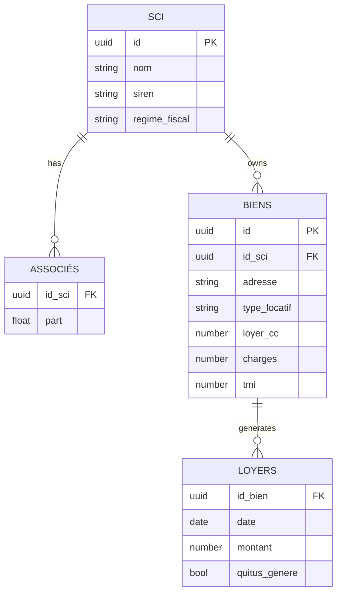

# Architecture Overview

The SCI-Manager system follows a two-tier architecture with a FastAPI backend and a SvelteKit frontend. The database is hosted on Supabase (PostgreSQL) with row-level security rules (RLS). Payments integrate with Stripe for subscription and one-time plans.

## Database Tables (Supabase)

## API Endpoints (FastAPI v1)

- `GET /v1/biens` – list or create rental properties
- `GET /v1/loyers` – list or record rents
- `GET /v1/quitus` – generate quittus documents

The routers will live under `backend/app/api/v1/` and be included in `main.py` with prefixes.

## User Flow

1. **Onboarding:** user signs up via frontend, account is created in Supabase.
2. **Dashboard:** after login, dashboard shows owned SCIs, biens and rent overview.
3. **Compta:** user can add loyers entries and generate quittus PDFs.
4. **Billing:** Stripe handles subscription billing behind the scenes.

The frontend communicates with the backend APIs and directly with Supabase for realtime features.
