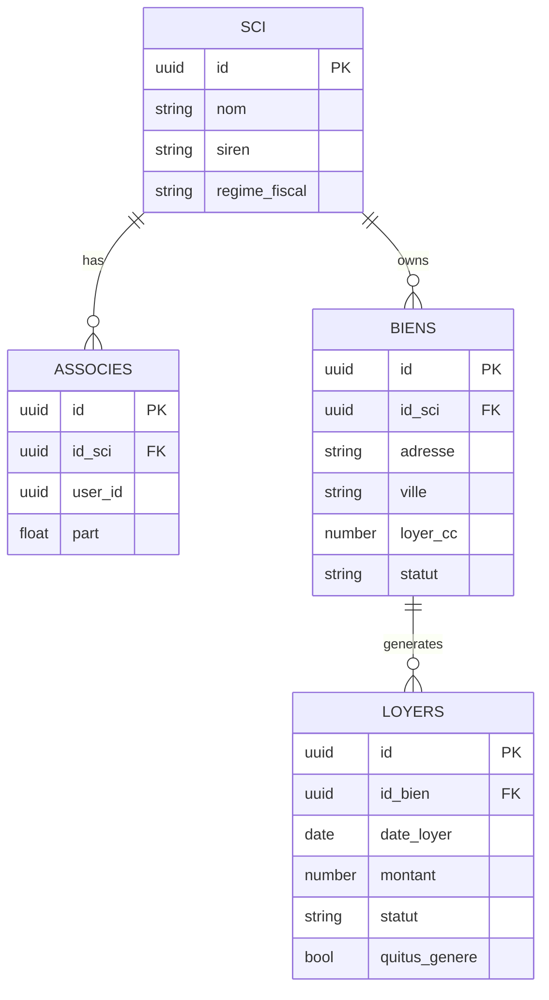

# Architecture Overview

SCI Manager repose sur une architecture web 2 couches avec séparation claire des responsabilités:

- **Frontend (SvelteKit)**: expérience utilisateur, workflows métier, visualisation KPI.
- **Backend (FastAPI)**: logique API, orchestration données, exposition endpoints métier.
- **Supabase (PostgreSQL + RLS)**: persistance et gouvernance d'accès.
- **Stripe**: monétisation (abonnements/plan payant).

## 1) Vue business -> technique

Chaque capacité business est mappée à un bloc technique:

- `Pilotage portefeuille` -> routes frontend `biens`, API `/v1/biens`, table `biens`.
- `Suivi encaissements` -> routes frontend `loyers`, API `/v1/loyers`, table `loyers`.
- `Production documentaire` -> composant quittus, API `/v1/quitus`.
- `Synthèse décisionnelle` -> dashboard frontend + agrégations côté UI/API.

## 2) Schéma de données cible (simplifié)

## 3) API métier (version actuelle)

- `GET /v1/biens` / `POST /v1/biens`
- `GET /v1/loyers` / `POST /v1/loyers`
- `GET /v1/quitus`

## 4) Flux applicatifs

1. L'utilisateur se connecte sur le frontend.
2. Le frontend appelle les endpoints backend `/v1/*`.
3. Le backend lit/écrit en base Supabase.
4. Les modules frontend affichent KPI/tables et états métier (chargement, vide, erreur).

## 5) Contraintes architecture à respecter

- RLS cohérent avec identité utilisateur (pas uniquement `id_sci`).
- Contrats API typés et alignés frontend/backend.
- Gestion d'erreurs explicite et homogène.
- Couverture de tests renforcée sur la logique haute valeur.

## 6) Prochaine cible d'évolution

- Intégrer l'authentification utilisateur côté backend (JWT contextuel).
- Ajouter une couche de services métier backend plus riche (agrégations KPI server-side).
- Introduire observabilité structurée (logs, trace IDs, erreurs).
