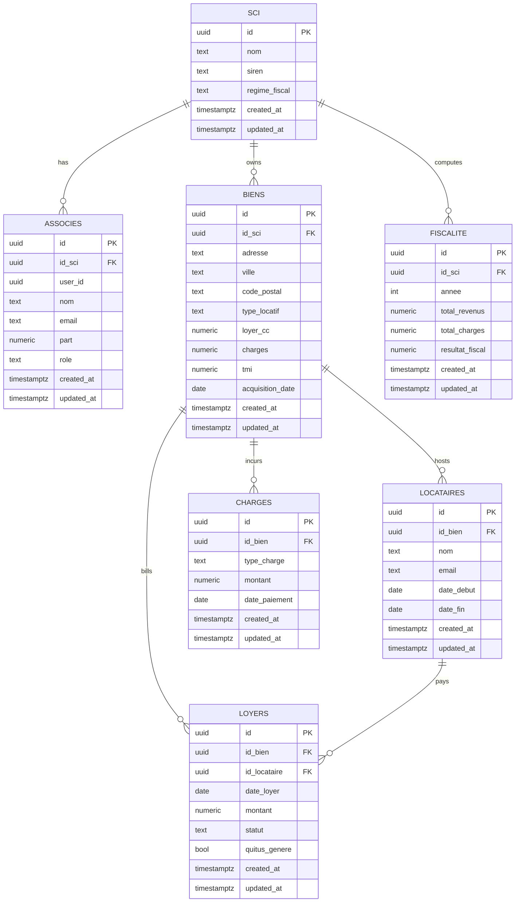
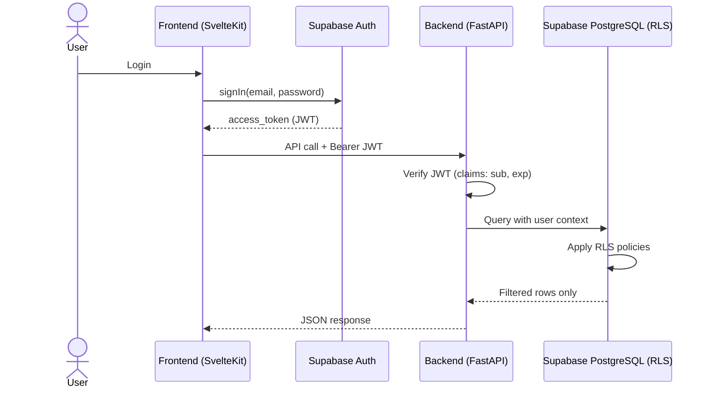
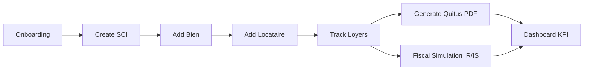
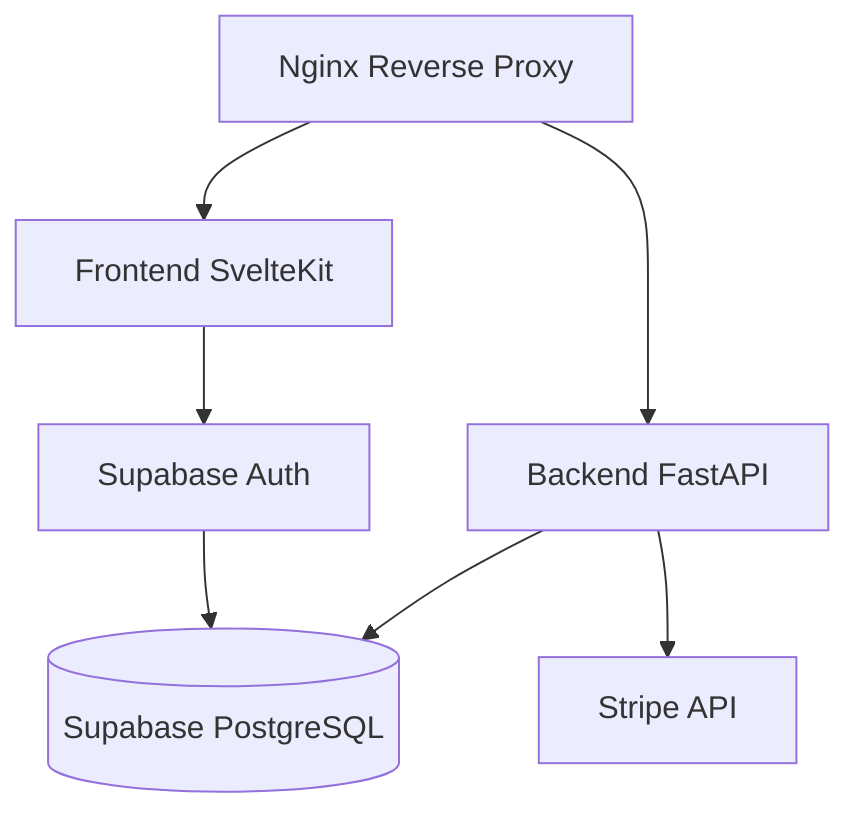

# SCI-Manager Architecture (Phase 1)

## 1. Vision Globale

SCI-Manager suit une architecture web modulaire:

- Frontend `SvelteKit` (UX, SSR, dashboard, parcours utilisateur)
- Backend `FastAPI` (API metier, validation, orchestration)
- Donnees `Supabase PostgreSQL` (RLS multi-utilisateurs)
- Paiement `Stripe` (abonnements + lifetime)
- Infra `Docker Compose` (reverse proxy + services applicatifs)

## 2. Modele de Donnees Supabase

## 3. Auth Flow: Supabase Auth -> JWT -> RLS

## 4. Endpoints Backend FastAPI

- `GET /health`
- `POST /api/v1/auth/*` (placeholder integration Supabase Auth)
- `GET|POST|PUT|DELETE /api/v1/sci`
- `GET|POST|PUT|DELETE /api/v1/biens`
- `GET|POST|PUT|DELETE /api/v1/loyers`
- `POST /api/v1/quitus/generate`
- `POST /api/v1/cerfa/2044`
- `POST /api/v1/fiscalite/simulate`
- `POST /api/v1/stripe/webhook`

## 5. Pages Frontend SvelteKit

- `/` landing
- `/(auth)/login`
- `/(auth)/register`
- `/dashboard`
- `/biens`
- `/loyers`
- `/pricing`

## 6. User Flow Produit

## 7. Docker Runtime Architecture

## 8. Notes Phase 1

- Schema SQL initialise toutes les tables metier + indexes + triggers `updated_at`.
- RLS est activee sur toutes les tables metier et filtre selon appartenance `associes.user_id`.
- Les routers backend sont prets pour la Phase 2 (impl detaillee ensuite).
