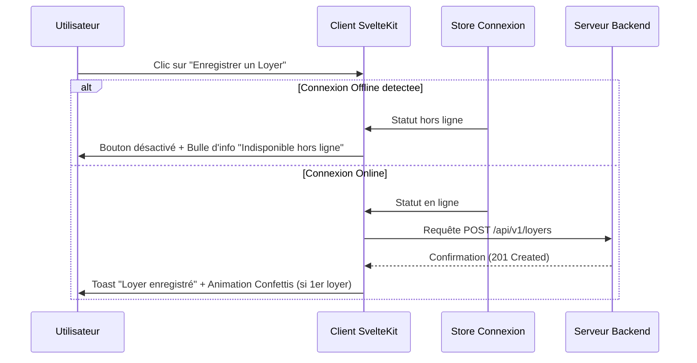

# Rapport d'Audit & Design Committee — GérerSCI

Ce document contient l'analyse de l'interface utilisateur de **GérerSCI**, SaaS Web B2B de gestion locative, de baux et de fiscalité foncière pour SCI familiales et investisseurs. Il est rédigé par le Comité de Design (Cabinets WEST, ALPINE, EAST) pour structurer le design system, analyser l'utilisabilité des écrans clés, optimiser l'accessibilité et proposer un plan d'action hiérarchisé.

---

## 1. Design System Recommendations

Pour assurer la cohérence visuelle, l'efficacité opérationnelle et un rendu professionnel "Dark Business", nous recommandons la consolidation des règles suivantes :

### Palette de Couleurs

La charte doit équilibrer un rendu corporate sobre avec des repères visuels clairs pour la comptabilité et les statuts réglementaires.

```mermaid
gantt
    title Palette de Couleurs GérerSCI
    dateFormat  X
    axisFormat %s
    section Principales
    Slate 950 (Fond Dark)     : active, color1, 0, 10
    Slate 800 (Primary/Header): active, color2, 0, 10
    Slate 50 (Secondary/Bg Light) : active, color3, 0, 10
    section Accents
    Blue 500 / Sky 600 (Actions/CTA) : active, color4, 0, 10
    Emerald 500 (Success/Payé) : active, color5, 0, 10
    Red 500 (Error/Retard) : active, color6, 0, 10
    Amber 500 (Warning/Vacant) : active, color7, 0, 10
```

| Rôle | Couleur | Tailwind Class | Usage | Ratio Contraste (Cible WCAG) |
| :--- | :--- | :--- | :--- | :--- |
| **Fond Sombre** | `#020617` | `bg-slate-950` | Arrière-plan principal en Dark Mode | > 15:1 sur texte blanc |
| **Primaire** | `#1e293b` | `bg-slate-800` | En-têtes, textes principaux, structures de navigation | > 7:1 sur Slate 50 |
| **Secondaire** | `#f8fafc` | `bg-slate-50` | Fonds de cartes, conteneurs secondaires, lignes alternées | > 7:1 sur texte Slate 800 |
| **Accent principal** | `#3b82f6` | `bg-blue-500` / `text-sky-600` | CTA principaux, liens interactifs, indicateurs d'état actif | > 4.5:1 sur blanc / noir |
| **Succès** | `#10b981` | `text-emerald-600` / `bg-emerald-50` | Loyers payés, bilans positifs, étapes d'onboarding validées | > 4.5:1 (attention : assombrir le texte en light) |
| **Erreur / Alerte** | `#ef4444` | `text-rose-600` / `bg-rose-50` | Retards de paiement, SCI dissoute, erreurs de validation | > 4.5:1 |
| **Avertissement** | `#f59e0b` | `text-amber-600` / `bg-amber-50` | Biens vacants, échéances fiscales en cours, limites de plan | > 4.5:1 |

> [!IMPORTANT]
> En mode clair (Light Mode), les classes comme `text-emerald-600` (`#10b981`) ou `text-amber-500` sur fond blanc ou vert/jaune clair manquent de contraste pour les petits textes (ratio < 4.5:1). Nous préconisons l'usage systématique de `text-emerald-700` (`#047857`) et `text-amber-700` (`#b45309`) pour les éléments textuels.

### Typographie

La typographie doit refléter la rigueur comptable et administrative tout en assurant une haute lisibilité sur écran.

*   **Police principale** : `Inter` (Sans-serif) avec fallback `system-ui, -apple-system, sans-serif`.
*   **Titres d'écrans (H1)** : `font-bold tracking-tight text-slate-900 dark:text-slate-100` (`text-3xl` ou `text-2xl`).
*   **Titres de sections (H2)** : `font-semibold tracking-wider text-slate-500 uppercase dark:text-slate-400` (`text-sm` ou `text-xs`).
*   **Textes de tableaux / Données numériques** : Utilisation recommandée des polices à chasse fixe pour les chiffres (`font-mono` ou `font-variant-numeric: tabular-nums`) afin d'aligner parfaitement les montants comptables verticalement.

### Espacement & Grille

*   **Base Spacing** : Alignement sur le pas de 4px de Tailwind.
    *   `p-1` / `m-1` : 4px (micro-ajustements, icônes)
    *   `p-2.5` / `py-2` : 8px - 10px (liens de navigation, cellules de tableau)
    *   `p-4` : 16px (formulaires simples, espacement de badges)
    *   `p-6` : 24px (remplissage standard des cartes de tableaux de bord)
    *   `p-8` : 32px (sections majeures, modals complexes)
*   **Grilles Responsive** :
    *   Tableau de bord et grilles de biens : `grid-cols-1 sm:grid-cols-2 lg:grid-cols-3` ou `lg:grid-cols-4` avec un espace constant de `gap-4` ou `gap-6` (16px / 24px).
    *   Largeur maximale de page : `max-w-7xl` (`1280px`) pour limiter l'étirement des lignes sur grands écrans, préservant ainsi le confort de lecture.

### Composants & États de l'Interface

Chaque composant doit posséder des indicateurs d'état explicites et interactifs :

*   **Boutons principaux (`Button`)** :
    *   *Default* : Bleu vif (`bg-sky-600` ou `bg-blue-600`) / Texte blanc.
    *   *Hover* : Éclaircissement ou assombrissement (`hover:bg-sky-700`).
    *   *Focus* : Halo visible sans masquer les contours (`focus-visible:ring-2 focus-visible:ring-blue-500 focus-visible:ring-offset-2`).
    *   *Active* : Effet d'enfoncement physique (`active:scale-[0.98]`).
    *   *Disabled* : Opacité réduite (`disabled:opacity-50 disabled:cursor-not-allowed`).
    *   *Loading* : Icône de chargement circulaire tournante (`Loader2` animée avec `animate-spin`) en remplacement du texte ou de l'icône principale pour bloquer les clics doubles.
*   **Champs de Formulaire (`Input`, `Select`)** :
    *   *Default* : Bordure grise (`border-slate-300 dark:border-slate-700`) / Fond blanc ou sombre neutre.
    *   *Focus* : Accentuation de la bordure et léger halo (`focus:border-blue-500 focus:ring-2 focus:ring-blue-500/20`).
    *   *Error* : Bordure rouge (`border-rose-500 focus:ring-rose-500/20`) avec message textuel clair sous le champ.
    *   *Empty (Placeholder)* : Texte estompé (`placeholder:text-slate-400 dark:placeholder:text-slate-500`).

---

## 2. Analyse Écran par Écran

L'analyse porte sur les 5 écrans majeurs du parcours utilisateur :

### A. Dashboard (Cockpit de l'investisseur)

*   **Hiérarchie visuelle** : L'en-tête affiche le titre "Dashboard" et l'électeur d'année fiscale (`AnneeSelector`), suivi d'un bandeau d'alertes en cas d'anomalies de paiement. Juste en dessous, les KPIs clés (Nombre de SCI, nombre de biens, taux de recouvrement, cashflow net) occupent le haut de page, suivis de la liste des SCI sous forme de cartes et enfin d'un journal des activités récentes en bas.
*   **Point d'entrée principal (CTA)** :
    *   *Nouvel utilisateur* : Grand encart de bienvenue avec un bouton de mise en route (`OnboardingTour` / `/onboarding`).
    *   *Utilisateur actif* : Navigation vers une SCI spécifique via la liste ou le menu déroulant de la barre de navigation supérieure (`SCI Switcher`).
*   **Charge cognitive** : Faible à moyenne. Les indicateurs sont agrégés par année. L'encart vide de bienvenue structure le parcours initial en 3 étapes claires (Créer SCI $\rightarrow$ Ajouter Bien $\rightarrow$ Suivre Loyers) évitant l'effet de page blanche.
*   **Progressive disclosure (Divulgation progressive)** : Les détails opérationnels d'une SCI ne sont pas affichés ici. Cliquer sur une carte SCI redirige l'utilisateur vers son cockpit dédié, allégeant la vue consolidée.

### B. Vue SCI (Tableau de bord de la SCI)

*   **Hiérarchie visuelle** : Titre fort (nom de la SCI) et SIREN, avec badges de rôle (Gérant/Associé) et statut de l'exploitation. Suivi des liens rapides (Biens, Associés, Régime fiscal, Documents) sous forme de compteurs de données. En dessous, les indicateurs de loyer cible, encaissé, cashflow net et taux de recouvrement, puis le calendrier fiscal interactif et les tableaux comptables.
*   **Point d'entrée principal (CTA)** : Le bouton de raccourci pour exporter les données ou modifier les paramètres de la SCI. Les actions de gestion avancée (changer de gérant, modifier le capital, dissoudre la SCI) sont intelligemment masquées derrière un menu déroulant "Gestion".
*   **Charge cognitive** : Élevée. Cet écran regroupe des données de gouvernance, des chiffres comptables annuels et mensuels et un calendrier fiscal. C'est l'écran le plus dense du produit.
*   **Progressive disclosure** : Les formulaires de modification du capital ou de changement de gérant s'ouvrent en ligne sous forme de panneaux rétractables uniquement à la demande de l'utilisateur. La comptabilité annuelle et mensuelle est gérée par des onglets imbriqués pour éviter une surcharge de tableaux.

### C. Vue Biens (Portefeuille de biens immobiliers)

*   **Hiérarchie visuelle** : Titre de section "Biens" avec options d'affichage en grille ou en liste à droite. Boutons d'action pour importer des biens (CSV) et "Ajouter un bien".
*   **Point d'entrée principal (CTA)** : Le bouton d'ajout de bien (`Plus` icon). Si la limite du plan d'abonnement est atteinte, le bouton se désactive visuellement et un message propose un changement de plan.
*   **Charge cognitive** : Faible. La structure présente chaque bien sous forme de fiche synthétique contenant son adresse, sa ville, sa rentabilité brute estimée et son cashflow annuel.
*   **Progressive disclosure** : Un indicateur visuel de couleur (vert, orange, rouge) résume l'état des obligations réglementaires (présence d'un locataire, d'un bail actif). Les détails complets du bien, de son assurance PNO, de son crédit et de son agence de gestion sont déportés sur la fiche de bien individuelle (`/biens/[bienId]`).

### D. Vue Loyers (Suivi de trésorerie par bien)

*(Tab "Loyers" situé dans la fiche individuelle d'un bien)*
*   **Hiérarchie visuelle** : En-tête avec bouton "Enregistrer un loyer". Tableau chronologique recensant la période (mois), le montant du loyer, le statut de paiement sous forme de badge de couleur (Payé, En attente, En retard), la présence d'une quittance PDF téléchargeable, la date effective de paiement et les actions associées.
*   **Point d'entrée principal (CTA)** : Bouton "Enregistrer un loyer". Lors du clic, un formulaire inline s'ouvre, évitant de quitter le contexte visuel du tableau.
*   **Charge cognitive** : Faible. Les filtres par statut et par année permettent de réduire rapidement le nombre de lignes affichées. Les totaux calculés en pied de page se mettent à jour de manière dynamique.
*   **Progressive disclosure** : Le bouton de génération de quittance n'est disponible que si le loyer possède le statut "Payé". Le bouton d'envoi par email n'apparaît que lorsque le fichier PDF de la quittance a été généré sur le serveur, évitant les erreurs d'envoi à vide.

### E. Simulateur / CERFA (Estimation d'impôt et prospection)

*   **Hiérarchie visuelle** : En-tête accrocheur rappelant la gratuité de l'outil. Page divisée en deux colonnes : à gauche, la saisie des données financières (loyers bruts, charges, intérêts d'emprunt, travaux) ; à droite, le volet des résultats fiscaux en temps réel (résultat foncier net, estimation d'impôt) et le tunnel de capture d'email.
*   **Point d'entrée principal (CTA)** : Le module de capture d'email (`EmailCapture`) qui débloque les résultats avancés (comparaison micro-foncier vs réel, déficit reportable).
*   **Charge cognitive** : Faible à moyenne. Les champs de saisie sont accompagnés de descriptions didactiques pour aider les investisseurs novices à classifier leurs charges (par exemple, ce qui relève de la taxe foncière ou des intérêts de crédit).
*   **Progressive disclosure** : Les détails fiscaux complexes ne s'affichent qu'après déblocage par email. Cela permet de ne pas décourager l'utilisateur dès sa première interaction tout en créant une incitation claire à la conversion.

---

## 3. Interactions & Animations

Pour un SaaS B2B, les animations doivent être fluides et rapides (durée $< 300\text{ms}$) afin de ne pas ralentir le travail des professionnels.

### Gestes & Touch

*   **Menu Drawer sur Mobile** : Le menu de navigation mobile glisse depuis la gauche (`slideInLeft` à $200\text{ms}$). L'utilisation d'une zone de fond semi-transparente permet de fermer le menu en tapotant en dehors de celui-ci.
*   **Navigation par Onglets et Fiche Bien** : Les onglets de la fiche bien défilent horizontalement sur mobile (`overflow-x-auto`) sans briser le gabarit de la page.

### Micro-animations

*   **Bouton de chargement (`Loader2`)** : Animation de rotation infinie (`animate-spin`) sur les boutons lors des exports ou des soumissions de formulaires (par exemple, lors de la génération de quittances).
*   **Changement de valeur (`Simulateur`)** : Lors de la modification des revenus dans le simulateur, le bloc de résultat de la colonne droite s'anime avec un léger effet de zoom (`scale-[1.01] transition-transform duration-200`) pour matérialiser visuellement la mise à jour des calculs.
*   **Menu déroulant / Select** : Les chevrons des listes déroulantes basculent de $180^\circ$ (`transition-transform`) lors de l'ouverture et de la fermeture des menus (gouvernance SCI, switcher).

### Retours d'Information (Feedbacks) & Toasts

*   **Notifications Toasts** : Apparition instantanée dans le coin inférieur droit de messages clairs en cas de succès (ex. *Loyer marqué payé*, *Quittance générée*) ou d'erreur (ex. *Impossible d'exporter les biens*).
*   **Sensibilité Réseau (Offline)** : Dans la liste des loyers, si l'appareil perd sa connexion internet, les boutons de modification de statut et de création de loyer affichent des messages d'explication informatifs (ex. *Marquage indisponible hors ligne*) basés sur le store réactif `$lib/stores/connectivity`.

*   **Célébrations (Gamification)** : L'enregistrement du premier bien ou du premier loyer déclenche l'apparition temporaire d'animations marquantes (confettis, badge de félicitation `Celebration.svelte`) pour renforcer le sentiment de complétion et valoriser les progrès de l'utilisateur dans l'outil.

---

## 4. Accessibilité (A11y) & Inclusivité

L'accessibilité numérique doit viser le niveau **WCAG 2.1 AA** au minimum pour garantir l'utilisabilité par tous.

### Contraste et Couleurs (Cible WCAG)

*   **Vigilance sur le Mode Sombre** : Les textes contrastés comme Slate 400 sur Slate 900 doivent maintenir un ratio minimum de 4.5:1.
*   **Signaux d'état de couleur** : Les cercles de couleur représentant le statut des biens (Vert = Occupé, Orange = En travaux, Rouge = Vacant) ne doivent pas être la seule source d'information. Des attributs `aria-label` descriptifs et des info-bulles textuelles explicites doivent obligatoirement doubler ces indicateurs colorés pour les utilisateurs daltoniens.

### Cibles de Saisie Tactile (Touch Targets)

*   Tous les boutons et éléments interactifs (notamment dans la navigation rapide sur mobile) doivent mesurer au minimum **44x44 CSS pixels** afin de faciliter la navigation au doigt sans erreur de ciblage.
*   L'espacement entre deux boutons adjacents dans les tableaux (ex. *Modifier* et *Supprimer* dans la table des biens) doit être d'au moins 8px.

### Navigation au Clavier

*   **Indicateur de Focus Visuel** : L'utilisation de `focus-visible:ring-2 focus-visible:ring-blue-500` est essentielle. Le focus ne doit jamais être masqué par des propriétés CSS (`outline: none` sans alternative).
*   **Pièges à focus (Keyboard traps)** : Les boîtes de dialogue modales (ex. `ConfirmDeleteModal`, `ImportCsvModal`) doivent capturer et contenir la touche `Tab` pour empêcher l'utilisateur de naviguer en arrière-plan sur la page masquée.

### Lecteurs d'Écran & Sémantique HTML

*   **Rôles ARIA et États** : Les menus interactifs doivent exploiter les bons rôles. Par exemple, le commutateur de SCI doit implémenter `aria-haspopup="listbox"` et les options internes `role="option"` avec un attribut `aria-selected` dynamique.
*   **Balises Sémantiques** : Utilisation stricte des balises `<nav>` pour le fil d'Ariane, `<main>` pour le contenu principal, `<header>` pour les en-têtes et `<table>` pour les listes tabulaires de données comptables.

### Gestion du Mode Sombre (Dark Mode)

Le projet spécifiant un mode "Dark Business" par défaut, l'inversion de contraste doit être soignée. Le composant `ThemeToggle` permet la transition fluide entre les thèmes clair et sombre via l'injection d'une classe `.dark` sur la balise racine `<html>`. Les variables CSS Tailwind (`dark:bg-slate-950`, `dark:border-slate-800`) adaptent instantanément les couleurs.

---

## 5. Plan d'Action Priorisé

Ce plan d'action hiérarchise les modifications d'interface utilisateur à apporter, classées de P0 (critique) à P3 (optimisation mineure).

| Écran | Problème | Solution | Composant concerné | Priorité |
| :--- | :--- | :--- | :--- | :--- |
| **Global (Navbar & Modals)** | Backdrops interactifs non sémantiques (click sans keyboard action sur les volets mobiles et modales) déclenchant des erreurs d'audit Svelte. | Remplacer les balises `div` d'arrière-plan avec événements click par des boutons natifs invisibles ou gérer correctement le rôle d'arrière-plan avec gestion des touches (`Escape`). | `AppNavbar.svelte`, `ConfirmDeleteModal.svelte` | **P0** |
| **Simulation / CERFA** | Commutateur de régime fiscal sémantiquement incomplet : utilise le rôle `radiogroup` mais pas d'attributs `aria-checked` ou de boutons de type radio sur les options. | Ajouter `aria-checked={regime === 'reel'}` sur les boutons du commutateur et s'assurer que le focus clavier fonctionne. | `simulateur-cerfa/+page.svelte` | **P1** |
| **Vue SCI** | Dropdown "Gestion" sans support de navigation au clavier (impossible de sélectionner "Changer de gérant" avec les flèches directionnelles). | Implémenter un menu accessible avec gestion des événements claviers (flèches haut/bas, touche Entrée) ou utiliser un composant de menu Shachn-Svelte accessible. | `scis/[sciId]/+page.svelte` (Dropdown Gestion) | **P1** |
| **Loyers (Fiche Bien)** | Contraste de couleur insuffisant pour les pastilles de statut (ex. Vert clair `bg-emerald-50 text-emerald-600` et Jaune clair `bg-amber-50 text-amber-500` en Light Mode). | Augmenter le contraste en remplaçant les classes de couleur de texte par des nuances plus foncées en mode clair (`text-emerald-700` et `text-amber-700`). | `FicheBienLoyers.svelte` (Badges de statut) | **P1** |
| **Dashboard** | KPI de variation annuelle ("vs N-1") manquant de précisions sémantiques pour les synthétiseurs vocaux (annonce juste un pourcentage positif ou négatif). | Ajouter une description textuelle accessible (`sr-only`) expliquant le calcul (ex. "Augmentation de 12% par rapport à l'année précédente"). | `Dashboard.svelte` / `DashboardKpis.svelte` | **P2** |
| **Vue Biens** | Doublement des indicateurs de statut pour les daltoniens sur les indicateurs d'obligations réglementaires (pastilles de couleur verte, orange, rouge). | Ajouter une icône distinctive en plus de la couleur de la pastille (ex. Icône Check pour vert, Point d'exclamation pour rouge/orange) ou un texte descriptif lisible. | `Biens/+page.svelte` (Grille et Liste) | **P2** |
| **Loyers (Fiche Bien)** | Pas de retour utilisateur visuel (skeleton loader) en cours de rafraîchissement suite au marquage d'un loyer comme payé ou génération de quittance. | Mettre la table ou les lignes concernées dans un état de chargement partiel avec effet d'opacité ou afficher un squelette de chargement pendant la ré-interrogation de l'API. | `FicheBienLoyers.svelte` | **P2** |
| **Simulation / CERFA** | Les champs de saisie de montants n'acceptent que des entiers et suppriment les caractères à la saisie, ce qui bloque la notation décimale (centimes d'euros). | Améliorer le parseur de saisie pour autoriser les nombres décimaux (séparateurs virgule ou point) et formater le rendu au focus-out. | `simulateur-cerfa/+page.svelte` (Inputs numériques) | **P3** |
| **Vue SCI** | Section "Exports" : Boutons volumineux prenant beaucoup de place verticalement. | Réorganiser la boîte d'exports en grille de boutons à deux colonnes avec des icônes plus minimalistes pour réduire l'encombrement visuel. | `scis/[sciId]/+page.svelte` (Gouvernance/Exports) | **P3** |
