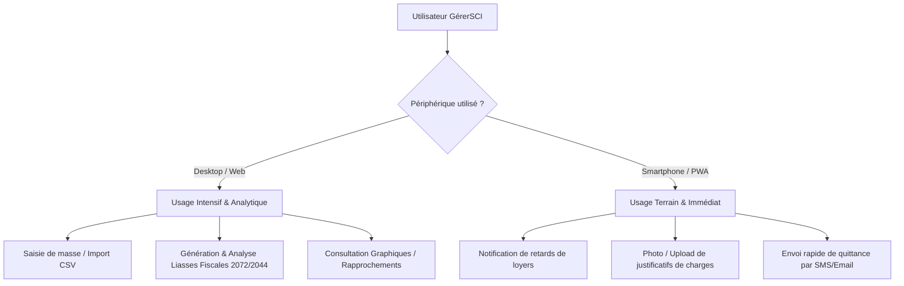
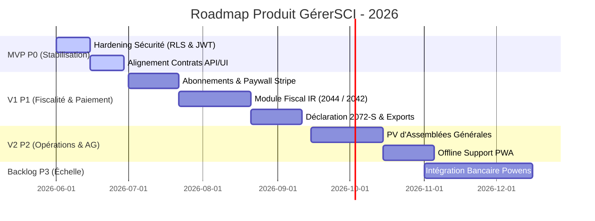

# Rapport du Comité d'Analyse Produit & d'Implémentation : GérerSCI

---

## 1. Matrice des Features

Cette matrice évalue les fonctionnalités clés de la plateforme **GérerSCI** (SaaS Web B2B de gestion locative et fiscale pour SCI familiales et investisseurs patrimoniaux) selon leur type, leur valeur utilisateur, leur complexité de réalisation, leur charge cognitive de maintenance, leur priorité stratégique et leur version de livraison.

| Feature | Type | Valeur | Complexité | Charge Cognitive | Priorité | Version |
| :--- | :--- | :--- | :--- | :--- | :--- | :--- |
| **Auth Magic Link & Callback** | Technique | Haute | Moyenne | Basse | **P0** | MVP |
| **Gestion Multi-SCI & Rôles** | Métier / Sécurité | Haute | Élevée | Moyenne | **P0** | MVP |
| **Gestion des Biens & Baux** | Métier | Haute | Moyenne | Moyenne | **P0** | MVP |
| **Suivi des Loyers & Encaissements**| Rétention | Haute | Moyenne | Basse | **P0** | MVP |
| **Génération Quittance & Quitus (Ind.)** | Acquisition / Rétention | Haute | Élevée | Moyenne | **P0** | MVP |
| **Paiements & Abonnements Stripe** | Monétisation | Haute | Élevée | Moyenne | **P1** | V1 |
| **Gestion de Fichiers (Storage)** | Technique | Moyenne | Moyenne | Basse | **P1** | V1 |
| **Notifications & Alertes Emails** | Rétention | Moyenne | Moyenne | Basse | **P1** | V1 |
| **Simulateur Foncier IR / IS public** | Acquisition | Moyenne | Basse | Basse | **P1** | V1 |
| **Calculs Fiscaux (2044 / 2042)** | Métier / Valeur | Haute | Très Élevée | Haute | **P1** | V1 |
| **Déclaration 2072-S PDF** | Métier / Différenciation | Haute | Très Élevée | Haute | **P1** | V1 |
| **Génération Quitus en Lot (Batch)** | Rétention | Haute | Élevée | Moyenne | **P1** | V1 |
| **Admin Panel (KPIs, Audit Logs)** | Administration | Moyenne | Moyenne | Basse | **P2** | V2 |
| **Assemblées Générales & PV** | Métier / Juridique | Haute | Moyenne | Moyenne | **P2** | V2 |
| **Suivi des Crédits Immobiliers** | Métier | Moyenne | Moyenne | Moyenne | **P2** | V2 |
| **Offline Support / PWA** | Technique | Moyenne | Élevée | Élevée | **P2** | V2 |
| **Rapprochement Bancaire (OFX/CSV)** | Différenciation | Haute | Très Élevée | Élevée | **P3** | Backlog (V3) |
| **Télétransmission EDI-TDFC** | Différenciation | Très Haute | Très Élevée | Très Haute | **P3** | Backlog (V3) |

---

## 2. Spécifications par Feature (Fiches Détaillées)

### Fiche 1 : Authentification Magic Link & Onboarding
* **JTBD (Job-To-Be-Done)** : *« En tant que gérant de SCI débordé, je veux me connecter de manière ultra-sécurisée sans avoir à mémoriser un énième mot de passe complexe, afin d'accéder instantanément à mes données depuis n'importe quel appareil. »*
* **Comportement attendu** :
  1. L'utilisateur saisit son adresse email sur `/login` ou `/register`.
  2. Le backend FastAPI appelle Supabase Auth OTP pour envoyer un email contenant un lien magique à usage unique (expirable sous 24h).
  3. L'utilisateur clique sur le lien et est redirigé vers `/auth/callback` avec le jeton d'accès.
  4. Le frontend SvelteKit valide le jeton et initialise la session JWT. Si c'est sa première connexion, l'utilisateur est orienté vers le tunnel d'onboarding (`/onboarding`), sinon vers le tableau de bord principal (`/dashboard`).
* **Comportement de préemption** :
  * Si la session JWT expire ou si l'utilisateur tente d'accéder à un écran protégé sans jeton, le routeur client SvelteKit le redirige immédiatement vers `/login` avec un message d'avertissement.
  * Au niveau de l'API FastAPI, le middleware d'authentification (`get_current_user`) intercepte la requête et renvoie immédiatement un statut HTTP `401 Unauthorized`.
* **États de la fonctionnalité** :
  * `anonymous` : Visiteur non authentifié.
  * `sending_otp` : Appel en cours pour l'envoi du mail.
  * `otp_sent` : Lien envoyé, message de succès affiché à l'écran.
  * `authenticated` : Session active, jeton JWT valide stocké dans le navigateur.
  * `session_expired` : Jeton expiré, invitation à se reconnecter.
* **Poka-Yoke (Anti-erreur)** :
  * Désactivation du bouton d'envoi si le champ email ne respecte pas l'expression régulière standard d'une adresse email.
  * Limiteur de débit (Rate limiting) configuré sur le backend à **3 requêtes d'envoi par minute** par IP pour éviter le spam et les surcoûts liés à la plateforme d'envoi d'emails (Resend).
* **Cas limites** :
  * **Double clic sur le lien magique** : Le token est consommé dès le premier accès. Si l'utilisateur clique à nouveau, le serveur de callback doit intercepter l'erreur et afficher un écran clair : *"Ce lien a déjà été utilisé ou a expiré. Saisissez votre adresse email pour en recevoir un nouveau."* plutôt qu'une erreur technique brute.
  * **Crawlers de messagerie (Spam filters)** : Certains serveurs de messagerie scannent et ouvrent automatiquement les liens. La vérification du lien magique s'effectue donc côté client au chargement de la route `/auth/callback` via un appel `POST` asynchrone plutôt qu'une simple redirection `GET` directe sur le lien d'origine, évitant ainsi la consommation silencieuse du code OTP par les robots de sécurité.
* **Dépendances** : Supabase Auth (OTP), service Resend API pour le routage de messagerie, templates Jinja2 d'emails.
* **Critères d'acceptation** :
  * L'envoi du lien magique prend moins de 3 secondes en conditions normales.
  * Toute tentative d'accès sans authentification à `/dashboard`, `/biens`, `/loyers` provoque une redirection automatique vers `/login`.
  * La déconnexion efface proprement le cookie de session et invalide le jeton client.

---

### Fiche 2 : Gestion Multi-SCI & Rôles des Associés
* **JTBD** : *« En tant qu'investisseur gérant plusieurs structures juridiques, je veux centraliser toutes mes entités sur un seul compte et inviter mes associés en limitant leurs droits de modification afin de préserver l'intégrité de ma comptabilité. »*
* **Comportement attendu** :
  1. L'utilisateur accède à un menu déroulant dans la barre latérale pour basculer de SCI active.
  2. Chaque SCI dispose de sa propre table d'associés (`associes`) contenant les pourcentages de parts (`part`) et les rôles (`role` : `gerant`, `associe`).
  3. Le gérant peut inviter un nouvel associé via `/scis/[sciId]/associes` en spécifiant son email et son nombre de parts.
  4. L'associé invité reçoit un email d'invitation et accède aux données de la SCI en lecture seule, sauf si le rôle de co-gérant lui est accordé.
* **Comportement de préemption** :
  * Les politiques de sécurité RLS (Row Level Security) au niveau de Supabase PostgreSQL filtrent à la source toutes les requêtes : un utilisateur ne peut voir ou interagir avec les lignes d'une SCI que si son `user_id` est présent dans la table `associes` pour cette SCI.
  * Tout appel API d'écriture (POST/PUT/DELETE) sur les biens, les baux ou la fiscalité est intercepté par le décorateur FastAPI `require_gerant_role` et renvoie une erreur `403 Forbidden` si l'utilisateur est un simple associé.
* **États de la fonctionnalité** :
  * `active_sci_context` : Contexte d'entité actif configuré dans le store global du frontend.
  * `invite_pending` : Associé invité par email, en attente de liaison de son compte.
  * `joined` : Associé lié à la base avec session active.
* **Poka-Yoke** :
  * Lors de la saisie ou de l'invitation d'un nouvel associé, le système calcule la somme des parts existantes. Si `somme(parts_associes) + parts_nouvel_invite > nb_parts_total` de la SCI, l'action est bloquée et une alerte explicite s'affiche.
  * Avant de supprimer une SCI, le gérant doit obligatoirement saisir le nom exact de la SCI dans un champ de confirmation pour éviter les clics accidentels.
* **Cas limites** :
  * **Suppression du dernier gérant** : Un gérant ne peut pas modifier son propre rôle ou se retirer de la SCI s'il est le seul gérant actif. Il doit d'abord nommer un autre associé au rôle de `gerant`.
  * **Modification de la répartition des parts a posteriori** : Toute modification rétroactive des parts recalcule et vérifie l'historique des bilans fiscaux. Une alerte signale au gérant que modifier les parts affectera les déclarations fiscales des exercices précédents.
* **Dépendances** : RLS de Supabase PostgreSQL, middleware d'autorisation FastAPI.
* **Critères d'acceptation** :
  * Le changement de contexte de SCI dans l'interface actualise instantanément (en moins de 150 ms) tous les tableaux de bord et KPIs.
  * Un associé simple ne voit pas les boutons d'édition, d'ajout ou de suppression sur les interfaces de biens, baux et finances.
  * Les tentatives de requêtes manuelles REST directes pour modifier des données sans rôle gérant échouent avec une réponse HTTP 403 claire.

---

### Fiche 3 : Gestion des Biens & Contrats de Baux
* **JTBD** : *« En tant que propriétaire-bailleur, je veux lister mes biens immobiliers et y lier des contrats de bail actifs avec les locataires afin de générer automatiquement mes appels de loyer et mes calculs de charges. »*
* **Comportement attendu** :
  1. L'utilisateur clique sur « Ajouter un bien » et remplit l'adresse, le code postal, la ville, le type locatif, le loyer hors charges, les charges provisionnelles et la TMI (Taux Marginal d'Imposition).
  2. Dans l'onglet « Bail », il ajoute un ou plusieurs locataires (noms, emails) et définit la date de début et la date de fin du contrat de bail.
  3. L'application génère automatiquement la structure des échéances de loyers mensuels à partir de la date de début du bail.
* **Comportement de préemption** :
  * Si l'utilisateur tente d'ajouter un bien alors que son quota d'abonnement Stripe est atteint (ex: limite de 5 biens sur le plan Starter), le système intercepte la soumission avant l'appel API, bloque l'insertion et affiche un modal d'upgrade vers le plan Pro.
  * Toute tentative de forçage côté API renvoie une exception personnalisée `UpgradeRequiredError` (HTTP 402).
* **États de la fonctionnalité** :
  * `vacant` : Bien enregistré mais sans bail actif.
  * `loue` : Bien associé à un bail en cours de validité.
  * `bail_expire` : Date de fin du bail dépassée, bien à requalifier.
* **Poka-Yoke** :
  * Le code postal est limité à 5 caractères numériques.
  * La date de fin de bail doit être strictement supérieure à la date de début.
  * Le montant des charges ne peut pas être supérieur au loyer hors charges (alerte de cohérence).
* **Cas limites** :
  * **Baux qui se chevauchent** : Un bien ne peut pas avoir deux baux actifs sur une même période temporelle. L'enregistrement d'un nouveau bail valide la cohérence des dates avec les baux existants ou passés.
  * **Suppression d'un bien avec historique** : Si des loyers payés et des quittances de loyer sont liés à un bien, sa suppression physique est bloquée par défaut. L'utilisateur doit choisir entre archiver le bien (conserve l'historique financier pour les déclarations fiscales) ou confirmer la suppression en cascade de toutes les écritures associées.
* **Dépendances** : Supabase PostgreSQL (`biens`, `baux`, `locataires`), `SubscriptionService`.
* **Critères d'acceptation** :
  * L'insertion d'un bien s'effectue sans rechargement de la page (SvelteKit reactivity).
  * Les champs obligatoires non remplis sont mis en surbrillance rouge avec un message explicite sous chaque champ.
  * Les quotas d'abonnements sont systématiquement vérifiés côté serveur lors de la tentative de création.

---

### Fiche 4 : Suivi des Loyers & Génération de Quitus
* **JTBD** : *« En tant que gestionnaire, je veux visualiser l'état des paiements de mes locataires et générer instantanément leurs quittances de loyer mensuelles afin de les leur envoyer par email en un clic. »*
* **Comportement attendu** :
  1. Le système crée chaque mois une ligne de loyer au statut `en_attente`.
  2. Le gérant modifie le statut en `paye` ou `en_retard` d'un simple clic depuis le tableau de bord ou la liste des loyers.
  3. Dès qu'un loyer est marqué comme `paye`, le bouton « Générer Quittance » devient actif.
  4. L'utilisateur peut prévisualiser la quittance au format PDF (rendu direct via `iframe`) ou cliquer sur « Envoyer par email » pour que le système transmette le document directement au locataire via Resend.
  5. Une route publique `/generateur-quittance` fait office de lead magnet (outil gratuit de génération de quittance unique, sans base de données ni authentification).
* **Comportement de préemption** :
  * La génération du PDF de quittance est strictement bloquée si le loyer correspondant n'est pas marqué comme `paye` dans la base de données.
  * Si le plan de l'utilisateur n'autorise pas la génération documentaire (vérifié via les entitlements du compte), l'action de génération renvoie une erreur de paywall.
* **États de la fonctionnalité** :
  * `en_attente` : Loyer exigible mais non encore encaissé.
  * `paye` : Loyer encaissé, quittance générable.
  * `en_retard` : Échéance dépassée sans encaissement.
  * `quittance_generee` : Fichier PDF créé et stocké dans le bucket.
  * `quittance_envoyee` : Email envoyé avec succès au locataire.
* **Poka-Yoke** :
  * Génération automatique d'un numéro de quittance séquentiel unique par SCI et par année (ex: `Q-2026-001`) pour éviter tout doublon documentaire ou trou de numérotation, conformément aux exigences comptables.
  * Vérification de la présence de l'email du locataire avant d'autoriser l'action d'envoi d'email.
* **Cas limites** :
  * **Paiement partiel** : Si le locataire paie seulement une partie du loyer, l'utilisateur indique le montant perçu. Le système génère alors un reçu de paiement partiel à la place d'une quittance libératoire de loyer.
  * **Échec d'envoi de l'email par Resend** : En cas d'erreur de délivrabilité, le PDF reste accessible au téléchargement direct et un badge d'erreur signale le statut d'échec sur la ligne de loyer.
* **Dépendances** : Service PDF (ReportLab), Supabase Storage (bucket `documents`), API Resend.
* **Critères d'acceptation** :
  * Le PDF généré respecte strictement la loi du 6 juillet 1989 (distinction nette entre loyer hors charges et charges locatives).
  * L'appel de génération prend moins de 4 secondes pour un fichier PDF standard de 1 page.
  * Le document PDF stocké dans Supabase n'est accessible qu'aux membres de la SCI via RLS.

---

### Fiche 5 : Calculs Fiscaux & Déclaration 2072-S / Résumé 2044 / Report 2042
* **JTBD** : *« En tant que contribuable associé d'une SCI à l'IR, je veux calculer automatiquement mes résultats fiscaux réels et générer mes formulaires fiscaux (2072-S, 2044 et report 2042) pré-remplis afin de télétransmettre ma déclaration de revenus sans faire d'erreur de calcul. »*
* **Comportement attendu** :
  1. Le backend agrège toutes les recettes (loyers perçus hors charges) et dépenses (charges déductibles payées basées sur la date de paiement réelle) sur l'année civile sélectionnée.
  2. Le système propose un tableau de synthèse fiscale per-bien avec correspondance exacte des lignes fiscales CERFA 2044 (L211 à L240).
  3. L'utilisateur peut export la déclaration de résultats complète 2072-S au format PDF, pré-remplie avec les informations de la SCI, des biens, et des associés.
  4. Pour chaque associé, l'application génère un feuillet d'instructions individuelles (report 2042) calculant sa quote-part exacte et lui indiquant les cases précises à remplir sur sa déclaration d'impôt personnelle (cases 4BA, 4BB, 4BC, 4BD).
* **Comportement de préemption** :
  * Si la SCI est sous le régime de l'impôt sur les sociétés (IS), l'accès aux formulaires IR (2044/2072) est bloqué. Le système affiche une alerte orientant vers les obligations comptables et fiscales de l'IS (liasse 2065/2033).
* **États de la fonctionnalité** :
  * `calculating` : Agrégation des écritures comptables en tâche de fond.
  * `ready` : Données consolidées prêtes à l'export.
  * `invalid_allocation` : Somme des parts des associés différente de 100%, bloquant la génération du formulaire 2072.
* **Poka-Yoke** :
  * Si les parts déclarées des associés ne totalisent pas exactement 100%, l'application lève une erreur de validation bloquante (`ValidationError`) et refuse de générer la déclaration 2072-S pour éviter les rejets de l'administration fiscale.
  * Ventilation automatique et obligatoire des charges entre déductibles et non déductibles lors de leur saisie (ex: taxe foncière déductible hors taxe d'enlèvement des ordures ménagères).
* **Cas limites** :
  * **Déficit foncier supérieur à 10 700 €** : L'outil calcule automatiquement la part du déficit imputable sur le revenu global et reporte le reliquat (déficit non admis) sur les revenus fonciers des 10 années suivantes (suivi via un historique reportable dans la table `fiscalite`).
* **Dépendances** : Service d'agrégation fiscale (`ResumeFiscalService`), moteurs de rendu PDF (`Declaration2072PdfService`, `ResumeFiscalPdfService`, `Report2042PdfService`).
* **Critères d'acceptation** :
  * Les calculs mathématiques de répartition des bénéfices ou pertes concordent à l'euro près avec les pourcentages de parts détenues par chaque associé.
  * Le PDF produit de la déclaration 2072-S reprend les cadres I à V officiels.

---

### Fiche 6 : Système de Paywall & Abonnements Stripe
* **JTBD** : *« En tant que fondateur de la plateforme, je veux facturer l'accès à GérerSCI de manière transparente selon le niveau de complexité de l'utilisateur, tout en appliquant les restrictions de sécurité côté client et serveur. »*
* **Comportement attendu** :
  1. L'utilisateur accède à la page `/pricing`.
  2. Le clic sur une offre initie une session Stripe Checkout en transmettant la clé de l'offre (`Starter`, `Pro`, `Lifetime`).
  3. Après paiement, Stripe notifie le backend via un webhook sécurisé.
  4. Le profil utilisateur est mis à jour instantanément avec ses nouveaux droits d'accès (entitlements).
* **Comportement de préemption** :
  * Toute action qui dépasse les quotas autorisés du plan actif (ex: ajout d'une deuxième SCI sous le plan Starter ou tentative d'export fiscal sans plan Pro) est bloquée à deux niveaux :
    * Sur l'interface utilisateur (boutons grisés avec icône de cadenas et modal d'upgrade).
    * Sur l'API REST via le service `SubscriptionService` qui lève une exception `UpgradeRequiredError` (HTTP 402/403).
* **États de la fonctionnalité** :
  * `active` : Abonnement valide, prélèvements à jour.
  * `past_due` : Échec de paiement Stripe, période de grâce de 7 jours active.
  * `canceled` : Abonnement résilié, compte rétrogradé en lecture seule ou limites de base réappliquées.
  * `lifetime` : Achat unique à vie, accès illimité Pro permanent.
* **Poka-Yoke** :
  * Le backend valide obligatoirement la signature cryptographique du webhook Stripe (`Stripe-Signature`) pour empêcher l'usurpation d'identité ou la falsification de requêtes de paiement.
  * Les Price IDs Stripe ne sont jamais stockés en dur dans le code du frontend mais résolus dynamiquement par le backend FastAPI à partir des configurations d'environnement.
* **Cas limites** :
  * **Rétrogradation de plan avec volume excédentaire** : Si un utilisateur passe du plan Pro au plan Starter alors qu'il a déjà configuré 3 SCI et 15 biens, le système ne supprime aucune donnée existante pour préserver l'historique utilisateur. Cependant, toutes les SCI et biens au-delà des limites du plan Starter sont passés en statut « lecture seule » et l'utilisateur ne peut plus créer de nouvelles entités.
* **Dépendances** : Stripe API, Stripe Webhooks, `SubscriptionService` FastAPI.
* **Critères d'acceptation** :
  * Tout événement Stripe Webhook non signé ou avec une signature invalide renvoie un statut HTTP 400.
  * La validation d'un paiement met à jour les privilèges utilisateur dans la base de données PostgreSQL en moins de 5 secondes.

---

### Fiche 7 : Admin Panel & Traçabilité (Audit Logs)
* **JTBD** : *« En tant qu'administrateur système de la plateforme, je veux suivre les statistiques clés de l'application et accéder aux journaux d'audit de sécurité afin de garantir la conformité RGPD et d'identifier rapidement les dysfonctionnements. »*
* **Comportement attendu** :
  1. Les administrateurs accèdent à `/admin` pour visualiser les KPIs financiers (MRR, LTV, taux de churn, cohortes d'utilisateurs).
  2. Un onglet d'audit affiche l'historique des actions critiques (connexions de comptes, exports documentaires, modifications de structures de parts, suppressions d'entités).
* **Comportement de préemption** :
  * Tout accès à la route `/admin` ou aux endpoints API associés (`/api/v1/admin/*`) par un utilisateur dépourvu du rôle `admin` déclenche un blocage immédiat et une redirection vers le tableau de bord standard, doublé d'une levée d'exception HTTP 403.
* **États** :
  * `authorized` : Rôle admin vérifié.
  * `unauthorized` : Rôle insuffisant, accès refusé.
* **Poka-Yoke** :
  * Écriture des logs d'audit en mode ajout uniquement (append-only) : aucune action d'édition ou de suppression des logs n'est exposée sur l'API d'administration pour préserver la traçabilité en cas d'audit.
  * Masquage automatique des données personnelles sensibles (PII) dans le journal d'audit (ex: adresses mails anonymisées, adresses de biens troncquées) pour être en conformité stricte avec les règles de la CNIL et du RGPD.
* **Cas limites** :
  * **Volume massif de logs** : Un système de rotation automatique archive et purge les logs d'audit datant de plus de 90 jours pour optimiser le stockage de la base de données.
* **Dépendances** : Table `audit_logs` PostgreSQL, middleware FastAPI d'autorisation admin.
* **Critères d'acceptation** :
  * Seuls les comptes spécifiquement marqués comme administrateurs dans Supabase Auth peuvent charger les pages `/admin`.
  * Chaque modification majeure de droit ou d'abonnement utilisateur écrit une ligne d'audit contenant le timestamp, l'action, l'ID utilisateur de l'opérateur et l'adresse IP d'origine.

---

## 3. Analyse Cross-Plateforme : Web vs Mobile PWA

GérerSCI est conçu comme une application **Web First** avec un support **Mobile PWA (Progressive Web App)** complet pour répondre aux deux contextes d'utilisation complémentaires du gérant de SCI.



### 3.1 Tableau Comparatif des Usages et Fonctionnalités

| Fonctionnalité | Version Desktop (Web) | Version Mobile (PWA) | Solution d'Implémentation |
| :--- | :--- | :--- | :--- |
| **Interface & Ergonomie** | Grandes tables de données, filtres multi-colonnes, graphiques de répartition complexes. | Layout simple à une colonne, menus tactiles (sheet menus), hauteur de ligne élargie pour le clic. | Tailwind CSS responsive-design (`md:block`, `hidden`), composants Svelte réactifs adaptés au format de l'écran. |
| **Import / Export** | Import massif de données par fichier CSV ou OFX. Téléchargement direct des PDFs. | Téléchargement local ou partage direct vers d'autres applications de messagerie (WhatsApp, Mail). | Utilisation de l'API Web Share (`navigator.share`) pour le partage sur mobile. |
| **Rendu Documentaire** | Prévisualisation PDF directement intégrée via un composant `iframe` côte-à-côte avec le formulaire. | Téléchargement direct du PDF sans prévisualisation en ligne pour préserver l'espace d'affichage. | Conditionnement du rendu : `feature_pdf_render_direct` activé sur desktop, téléchargement direct forcé sur mobile. |
| **Connectivité** | Connexion permanente supposée. | Support de la déconnexion réseau temporaire (transports, sous-sols de biens immobiliers). | Service Worker gérant la mise en cache des assets statiques (`Cache Storage`) et l'accès hors ligne. |
| **Capture de Justificatifs**| Glisser-déposer de fichiers PDFs ou images de factures depuis l'ordinateur. | Prise de photo directe des reçus et factures de charges via l'appareil photo du smartphone. | Balise input `<input type="file" accept="image/*" capture="environment">` activant l'appareil photo natif. |
| **Rappels & Alertes** | Notifications in-app affichées dans un centre de notifications dédié. | Notifications push système pour les retards de loyers ou les échéances fiscales importantes. | API Push Web standard liée à un service worker d'arrière-plan. |

---

## 4. Roadmap Priorisée

La roadmap est structurée en 4 phases claires, privilégiant d'abord la sécurisation du socle technique (Hardening) préconisée lors des audits, avant de déployer les fonctionnalités avancées à forte valeur ajoutée commerciale.



### 4.1 MVP P0 : Hardening & Fiabilisation (Mois 1)
* **Objectif** : Résoudre les dettes de sécurité identifiées (Audit Big4) pour stabiliser le produit avant toute phase de commercialisation active.
* **Livrables clés** :
  * **Sécurité RLS & JWT** : Correction complète des modèles d'identité dans Supabase PostgreSQL. Remplacement de l'association par clé globale par une politique RLS stricte basée sur `auth.uid() = user_id` dans la table pivot des associés.
  * **Authentification API** : Ajout d'une couche d'interception systématique des requêtes HTTP côté FastAPI via un validateur JWT Supabase. Remplacement des accès anonymes par des clients contextualisés par l'utilisateur connecté (`get_supabase_user_client`).
  * **Alignement UI/API** : Mise en conformité des schémas Pydantic avec les formulaires frontend (ex : intégration obligatoire de `id_sci` dans le payload de création de bien pour éviter les erreurs 422 en production).
  * **Correction TypeScript & CI** : Résolution des types implicites `any` et warning d'accessibilité (a11y) côté SvelteKit. Configuration locale de Playwright pour les tests unitaires systématiques.

### 4.2 V1 P1 : Fiscalité IR & Monétisation (Mois 2-3)
* **Objectif** : Lancer l'offre commerciale payante en apportant la proposition de valeur fiscale unique avant la période de déclaration d'impôts.
* **Livrables clés** :
  * **Paywall Stripe** : Intégration complète du flux Stripe Checkout, gestion des webhooks sécurisés pour l'activation/suspension des abonnements (`Starter`, `Pro`, `Lifetime`), application stricte des quotas d'insertion côté backend.
  * **Calculateur Fiscal Réel IR** : Module d'agrégation automatique des recettes et dépenses pour générer la synthèse foncière décomposée selon la grille du CERFA 2044.
  * **Formulaire 2072-S & 2042** : Export PDF officiel de la déclaration de résultats de la SCI et fiches de report personnalisées pour la déclaration de revenus de chaque associé.
  * **Génération en Lot (Batch Quitus)** : Possibilité de générer en une fois toutes les quittances d'un mois fiscal donné et de les expédier par Resend.

### 4.3 V2 P2 : Juridique & Mobilité PWA (Mois 4-5)
* **Objectif** : Compléter la couverture fonctionnelle de gestion de la SCI pour fidéliser l'utilisateur et réduire le taux de résiliation (churn).
* **Livrables clés** :
  * **Module Juridique Assemblées Générales** : Assistant de rédaction de résolutions, génération automatisée du procès-verbal d'AG annuelle, mise à jour du registre des décisions de la SCI.
  * **Suivi d'Amortissement & Crédits** : Enregistrement des emprunts immobiliers, calcul automatique de la part des intérêts d'emprunt déductibles fiscalement à chaque exercice.
  * **Progressive Web App (PWA)** : Mise en place d'un Service Worker robuste avec cache local des données critiques pour un usage fluide hors ligne sur mobile.

### 4.4 Backlog P3 : Automatisation & Échelle (Mois 6+)
* **Objectif** : Automatiser l'importation des données pour proposer une expérience utilisateur sans saisie manuelle.
* **Livrables clés** :
  * **Rapprochement Bancaire Automatique** : Partenariat d'agrégation bancaire (via Powens ou Bridge API) pour importer en temps réel les flux bancaires de la SCI et catégoriser automatiquement les loyers perçus et les dépenses payées.
  * **Télétransmission EDI-TDFC** : Raccordement direct avec les serveurs de la Direction Générale des Finances Publiques (DGFiP) pour télétransmettre le formulaire 2072-S sans saisie manuelle sur le portail impots.gouv.fr.

---

## 5. Recommandations Architecture

### 5.1 Architecture des Endpoints API FastAPI

Pour garantir la séparation stricte des privilèges et une isolation multi-locataires (multi-tenant) robuste, tous les endpoints de l'application suivent la convention de structure suivante :

```
/api/v1/scis                      [GET/POST]     - Gestion des contextes de SCI de l'utilisateur
/api/v1/scis/{sci_id}             [GET/PATCH/DEL]- Détails de la SCI (gérant uniquement pour modification/suppression)
/api/v1/scis/{sci_id}/associes    [GET/POST]     - Liste et invitation d'associés (gérant pour ajout)
/api/v1/scis/{sci_id}/documents   [GET]          - Agrégation de tous les fichiers de la SCI
/api/v1/biens                     [GET/POST]     - CRUD Biens immobiliers (vérification quota abonnement)
/api/v1/loyers                    [GET/POST/PUT] - Gestion des loyers mensuels
/api/v1/quitus/generate           [POST]         - Génération PDF individuelle
/api/v1/quitus/batch-generate     [POST]         - Génération groupée par mois fiscal
/api/v1/cerfa/scis/{sci_id}/2044  [GET]          - Données d'agrégation fiscale
/api/v1/cerfa/scis/{sci_id}/2072  [GET/POST]     - Génération PDF liasse fiscale
/api/v1/stripe/webhook            [POST]         - Webhook de facturation (non authentifié, vérification signature)
```

> [!IMPORTANT]
> **Règle de Sécurité Critique** : Les endpoints manipulant directement des ressources comme `/api/v1/biens` ou `/api/v1/loyers` doivent systématiquement récupérer le contexte utilisateur via le JWT fourni dans l'en-tête `Authorization`. Le backend doit valider que l'utilisateur appartient bien à la SCI liée au bien ou au loyer en effectuant une jointure avec la table `associes` avant toute opération en base.

### 5.2 Gestion de l'État : Global vs Local (SvelteKit)

Une bonne gestion d'état évite les requêtes redondantes et fiabilise le parcours utilisateur multi-SCI.

```mermaid
graph TD
    subgraph Global Stores (Application Wide)
        sessionStore[Session Store: User JWT, Email, Subscription Plan]
        sciStore[SCI Store: Active SCI ID, List of user SCIs, User Role]
    end
    
    subgraph Page Contexts (Local State)
        bienPage[Biens Page: Current Bien object, Form edit states]
        loyerPage[Loyers Page: Month filter value, Current list data]
    end
    
    sessionStore -->|RLS Context| sciStore
    sciStore -->|Context Filter| bienPage
    sciStore -->|Context Filter| loyerPage
```

* **État Global (Svelte Stores)** :
  * **Session Store** : Stocke l'état d'authentification de l'utilisateur (jeton JWT décodé, droits d'abonnement actifs). Initialisé au démarrage de l'application et mis à jour lors de la connexion/déconnexion ou via les webhooks de paiement.
  * **SCI Store** : Contient l'identifiant de la SCI actuellement sélectionnée dans l'interface, ainsi que la liste des SCI auxquelles l'utilisateur a accès. Ce store dicte le comportement de filtrage par défaut de toutes les autres pages.
* **État Local (Page-level)** :
  * Les listes de biens, de loyers et de charges d'une page spécifique doivent être chargées via les fonctions `load()` de SvelteKit au niveau de la route active, en utilisant le paramètre de la SCI active.
  * L'état des formulaires d'édition (champs de saisie, indicateurs de chargement local, messages d'erreur de saisie) doit rester strictement local au composant concerné pour éviter les pollutions de mémoire.

### 5.3 Stratégie de Feature Flags et Niveaux d'Abonnement

Pour piloter l'activation des fonctionnalités à distance sans redéploiement, le backend FastAPI intègre une vérification dynamique des droits basée sur deux types de flags :

1. **Flags Applicatifs Globaux (Feature Flags)** :
   * Définis dans les variables d'environnement du serveur (ex : `feature_pdf_render_direct`, `feature_cerfa_generation`).
   * Permettent de désactiver instantanément un service tiers en cas de panne (ex : si le rendu de PDF direct plante, on bascule vers un lien de téléchargement pur en passant le flag global à `False`).
2. **Entitlements par Plan d'Abonnement (Monétisation)** :
   * Chaque requête de création de ressource ou d'accès à un outil fiscal appelle le validateur `SubscriptionService`.
   * **Starter (19€/mois)** : Quota de SCI à 1, quota de biens à 5. Accès aux outils fiscaux avancés refusé.
   * **Pro (49€/mois) / Lifetime (299€)** : Multi-SCI activé (`multi_sci_enabled`), biens illimités, exports de liasses fiscales débloqués (`cerfa_enabled`).

### 5.4 Points de Vigilance Performance & Optimisations

* **Optimisation de la Génération de PDF (ReportLab)** :
  * Le rendu de documents PDF volumineux (comme la déclaration 2072-S) est consommateur de ressources processeur (CPU). Les endpoints de génération doivent utiliser des flux mémoire `io.BytesIO` pour éviter les opérations d'écriture de fichiers sur disque qui ralentissent les temps de réponse.
  * Les PDFs déjà générés et stockés dans Supabase Storage doivent être mis en cache à l'aide d'en-têtes HTTP de mise en cache appropriés (`Cache-Control: private, max-age=3600`) pour éviter de solliciter le stockage distant lors de téléchargements répétés par l'utilisateur.
* **Optimisation des Requêtes Base de Données** :
  * Pour éviter le problème classique des requêtes N+1 (par exemple, charger un bien puis faire une requête par bien pour récupérer les loyers), le backend doit utiliser des requêtes d'agrégation ou de jointure avec filtrage groupé (utilisation de l'opérateur `.in_()` sur les identifiants préalablement chargés).
  * Création d'index composites sur PostgreSQL pour accélérer les recherches fréquentes, notamment sur `associes(user_id, id_sci)` et `biens(id_sci)`.
* **Régulation des Appels API Tiers (Resend / Stripe)** :
  * L'envoi d'emails via l'API Resend doit être asynchrone (utilisation de tâches de fond FastAPI `BackgroundTasks`) pour libérer instantanément la réponse HTTP du client sans attendre la fin du protocole de transmission réseau du serveur de messagerie.
