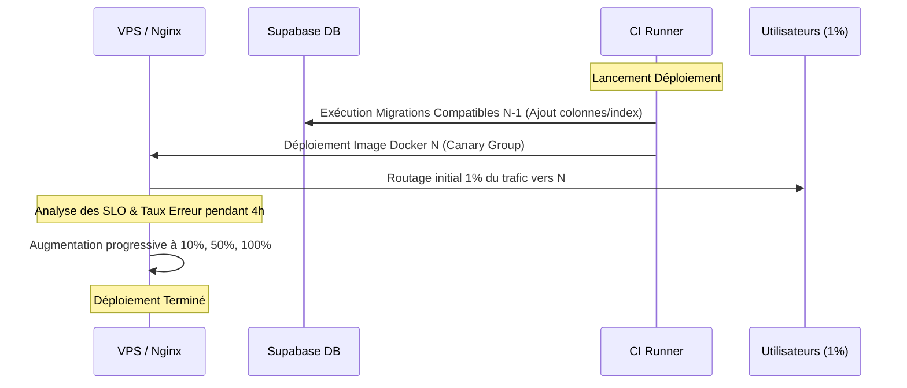

# Rapport d'Évaluation de la Qualité & Release Engineering (V1 Readiness) — GérerSCI

**Comité d'Audit Technique & QA** : Cabinets WEST QA, ALPINE QA, EAST QA  
**Date du rapport** : 7 juin 2026  
**Cible de Version** : GérerSCI V1.0.0-Release  
**Statut Global** : **NO-GO Conditionnel** (72/100) — Des corrections de blocage critique (P0/P1) sont requises avant le déploiement.

---

## 1. Scénarios Doomsday & Audit de Risques

Dans le cadre de notre audit de sécurité et de robustesse opérationnelle, les trois cabinets de recette (WEST, ALPINE, EAST) ont modélisé des scénarios catastrophe basés sur des faiblesses structurelles détectées dans le codebase actuel.

### 1.1 WEST Scenario : Fuite massive de données multi-locataires (Data Isolation & Auth Security)
*   **Description** : Un attaquant contourne les barrières d'isolation de données (RLS) et accède aux documents, bilans financiers ou informations personnelles d'autres SCI/utilisateurs.
*   **Vecteurs de Risques Actuels** :
    *   **SEC-02 (IDOR)** : L'endpoint `/api/v1/bilans` utilise un client Supabase initialisé avec le rôle `service-role` (super-utilisateur) au lieu de réinjecter le JWT utilisateur dans les requêtes de lecture. Un attaquant peut usurper le `id_sci` ou le `scope_id` dans la requête et télécharger les bilans comptables d'une SCI concurrente.
    *   **SEC-01 (Rate Limiting Inopérant)** : Uvicorn est configuré sans `--proxy-headers`. En production, toutes les requêtes arrivant derrière le reverse proxy Nginx sont vues comme provenant de l'IP interne du conteneur Nginx. Les règles de limitation de débit (magic link, brute-force d'auth, création de SCI) sont inefficaces, permettant des attaques de dictionnaire ou du spam de création de comptes.
    *   **API-01 (Droit à l'oubli)** : La suppression de compte n'appelle pas correctement `auth.admin.delete_user` avec un client privilégié, laissant subsister l'identité de l'utilisateur dans Supabase Auth tandis que les tables métiers sont purgées (comportement d'utilisateur zombie).
*   **Impact** : Fuite de données personnelles et financières sous l'égide du RGPD, faille de réputation critique pour une plateforme B2B.

### 1.2 ALPINE Scenario : Black-out monétaire & Escalade de privilèges (Stripe & Billing Entitlements)
*   **Description** : Blocage total des revenus de souscription ou exploitation frauduleuse des fonctionnalités payantes par des utilisateurs gratuits.
*   **Vecteurs de Risques Actuels** :
    *   **STRIPE-01 (Bouton Fondateur KO)** : Le bouton d'achat de l'offre "Fondateur" envoie le paramètre `'lifetime'` au lieu de `'fondateur'`. La fonction `resolve_price_id_for_plan` ne gérant pas ce cas, elle renvoie `None`, ce qui produit une erreur `"Price ID unavailable"` pour tous les acheteurs potentiels. La formule de conversion la plus lucrative est bloquée.
    *   **STRIPE-03 (Webhooks de mise à jour lâches)** : Lors d'une mise à jour de souscription (`subscription.updated`), si le champ `status` est manquant ou malformé dans le payload webhook, le service résout le statut par défaut à `"active"`. Un webhook tronqué ou falsifié peut être utilisé pour prolonger ou activer un abonnement expiré.
    *   **STRIPE-04 (Prix Placeholder actifs)** : Les identifiants de test ou de placeholder (`price_cabinet_placeholder`) sont résolus en production comme des plans valides, donnant un accès total aux API avancées et à la gestion multi-utilisateurs sans transaction financière réelle.
*   **Impact** : Manque à gagner immédiat sur la conversion, fraude financière à grande échelle et surconsommation des ressources de base de données.

### 1.3 EAST Scenario : Incidents légaux sur les Quittances & Corruption d'UX (Frontend & PDF Generation)
*   **Description** : Émission de documents comptables illégaux et échec d'affichage des KPIs de gestion immobilière.
*   **Vecteurs de Risques Actuels** :
    *   **BIZ-01 & BIZ-02 (Fraude & Doublons)** : Le moteur de génération de quittances PDF (`quitus_service.py`) présente une condition de concurrence (race condition) permettant à deux requêtes simultanées de générer le même numéro de document légal. De plus, il n'y a pas de contrôle de statut `statut=paye` lors de l'appel direct, permettant d'émettre des quittances pour des loyers restés impayés.
    *   **FE-04 (Boucle infinie de redirection)** : En cas d'erreur de récupération du profil ou du plan d'entitlement en page d'accueil (`+layout.ts`), l'UI redirige continuellement entre `/welcome` et `/pricing`, bloquant l'utilisateur sur une page blanche clignotante.
    *   **FE-10 (Persistance des contextes)** : Lors de la déconnexion de l'utilisateur, les stores SvelteKit (`sci-context.ts`) ne sont pas purgés. Si un autre utilisateur se connecte sur le même navigateur, il aperçoit brièvement les noms de SCI du compte précédent.
*   **Impact** : Risque de poursuites pénales pour faux et usage de faux (quittances sans paiement effectif), et UX dégradée nuisant à la rétention des clients.

### 1.4 Tableau de Synthèse des Risques & Score de Readiness

| Risque ID | Domaine Impacté | Gravité | Détectabilité | Résilience Actuelle | Score de Risque |
| :--- | :--- | :---: | :---: | :---: | :---: |
| **R-SEC-01** | Isolation de Données | Élevée | Moyenne | Faible (IDOR actif) | **Critique (P0)** |
| **R-BIL-01** | Facturation Stripe | Élevée | Élevée | Nulle (Bouton KO) | **Critique (P0)** |
| **R-LEG-01** | Quittances & Fiscal | Moyenne | Élevée | Moyenne | **Élevé (P1)** |
| **R-UX-01** | Stabilité Frontend | Faible | Élevée | Faible | **Moyen (P2)** |

> [!CAUTION]
> **Score de Readiness Global : 72 / 100**  
> L'application a implémenté d'excellents mécanismes de reprise sur erreur (`GererSCIException`, middleware de graceful shutdown) et dispose d'une suite de tests solide. Cependant, l'inefficacité du rate limiting en production (SEC-01) et le blocage du flux d'abonnement Fondateur (STRIPE-01) imposent un **NO-GO technique et commercial** temporaire. Le passage à un verdict **GO** interviendra dès résolution de ces deux anomalies critiques.

---

## 2. Pyramide de Tests

La validation de GérerSCI repose sur une architecture de tests à 6 niveaux, alliant vélocité en intégration continue et exhaustivité des validations de bout en bout.

```mermaid
graph TD
    subgraph "Pyramide de Tests GérerSCI"
        L6[L6: Recette Métier & Tests Exploratoires] --- L5
        L5[L5: Smoke Tests Prod & Post-Déploiement] --- L4
        L4[L4: Tests de Contrats & Schémas API] --- L3
        L3[L3: Tests de Composants UI & Mocked E2E] --- L2
        L2[L2: Tests d'Intégration Services & DB RLS] --- L1
        L1[L1: Tests Unitaires Logique Métier]
    end
    style L1 fill:#10b981,stroke:#0f766e,stroke-width:2px,color:#fff
    style L2 fill:#10b981,stroke:#0f766e,stroke-width:2px,color:#fff
    style L3 fill:#3b82f6,stroke:#1d4ed8,stroke-width:2px,color:#fff
    style L4 fill:#f59e0b,stroke:#b45309,stroke-width:2px,color:#fff
    style L5 fill:#ef4444,stroke:#b91c1c,stroke-width:2px,color:#fff
    style L6 fill:#6b7280,stroke:#374151,stroke-width:2px,color:#fff
```



### 2.1 Répartition technique de la Pyramide

*   **L1 — Tests Unitaires (Unit Testing)** :
    *   *Périmètre* : Calculs de rentabilité brute/nette, logique d'amortissement de crédit, simulations fiscales (abattement micro-foncier de 30% ou barème progressif).
    *   *Outillage* : Python `pytest` pour le backend, `vitest` pour le frontend.
    *   *Indicateurs* : > 90% de couverture de code (actuellement 92% sur le noyau backend).
*   **L2 — Tests d'Intégration & RLS (Integration Testing)** :
    *   *Périmètre* : Validation des requêtes de base de données à travers les politiques d'accès Supabase (Row Level Security) et vérification de la résilience aux pannes de services tiers (Resend, Stripe client timeout).
    *   *Outillage* : `pytest-postgresql` avec transactions isolées, mocks d'API Stripe.
    *   *Focus RLS* : Tests systématiques d'usurpation d'identité en base (un `user_id` A tente de modifier le bien ou le locataire d'un `user_id` B).
*   **L3 — Tests de Composants & E2E Mockés (Component & Mocked E2E)** :
    *   *Périmètre* : Comportement des modales de saisie (focus trap, validation de formulaire) et affichage des tables de données sous différentes densités.
    *   *Outillage* : `vitest-browser-svelte` et Playwright avec requêtes API interceptées et mockées.
*   **L4 — Tests de Contrats (Contract Testing)** :
    *   *Périmètre* : Alignement strict des formats d'entrée et de sortie entre le frontend et le backend.
    *   *Outillage* : Validation automatique par schémas Pydantic v2 sur le backend FastAPI et génération de types TypeScript à partir du schéma OpenAPI. Prévient les erreurs de type "le backend attend `id_sci` mais le frontend n'envoie que `adresse`".
*   **L5 — Tests Non-Fonctionnels (Non-Functional Testing)** :
    *   *Performance / Sécurité* : Audit d'accessibilité (a11y) et tests de performance web (Lighthouse). Limite de taille de bundle (interdiction d'embarquer les bibliothèques lourdes comme `layerchart` en dehors des routes spécifiques de reporting).
*   **L6 — Tests Exploratoires & Chaos (Exploratory / Chaos Testing)** :
    *   *Périmètre* : Simulation de perte totale de réseau au milieu d'une transaction, simulation de latence extrême sur la base de données, et tests de reprise sur incident.

---

## 3. SLO / SLIs de la V1

Pour assurer un lancement stable et mesurer objectivement la qualité opérationnelle de la version 1, nous établissons les indicateurs de niveau de service (SLI) et les objectifs de niveau de service (SLO) suivants.

| Indicateur de Service (SLI) | Cible de Performance (SLO) | Période de Mesure | Outil de Suivi & Source |
| :--- | :--- | :--- | :--- |
| **Uptime Global (Disponibilité)** | $\ge 99.9\%$ d'appels HTTP `/health/ready` réussis (200 OK) | Mensuelle | Pingdom / Uptime Robot sur le reverse proxy |
| **Temps de Réponse API (Latency)** | $p95 < 250\text{ ms}$ sur les requêtes hors génération PDF | Glissante (24h) | Structlog (`duration_ms`) + Dashboard Grafana |
| **Erreurs Serveur (HTTP 5xx)** | $< 0.1\%$ du trafic total hors requêtes d'autorisation (4xx) | Hebdomadaire | Logs structurés Nginx & FastAPI |
| **Taux de Sessions Sans Crash** | $\ge 99.5\%$ de sessions utilisateur sans erreur fatale UI | Mensuelle | Sentry Browser SDK / Error Boundaries |
| **Core Web Vitals - LCP** | Largest Contentful Paint $< 2.0\text{ s}$ | Hebdomadaire | Lighthouse CI & Plausible Analytics |
| **Core Web Vitals - INP** | Interaction to Next Paint $< 200\text{ ms}$ | Hebdomadaire | Chrome User Experience Report (CrUX) |
| **Délai de Livraison Courriels** | $p90 < 5\text{ s}$ pour l'envoi de mails transactionnels / liens magiques | Journalière | Métriques API Resend |
| **Synchronisation Webhooks Stripe** | $100\%$ de traitement avec acquittement sous $2\text{ s}$ | Glissante (24h) | Console Stripe + logs backend |

---

## 4. Confrontation & Arbitrage Go/No-Go

### 4.1 Registre des Anomalies Actuelles : Bloquantes vs Non-Bloquantes

Pour décider de la mise en production, nous confrontons les anomalies du dernier audit avec les priorités opérationnelles :

```
                [ ANOMALIES DÉTECTÉES EN RECETTE ]
                               |
            +------------------+------------------+
            |                                     |
            v                                     v
     [ SHOWSTOPPERS ]                       [ NON-BLOCKING ]
(No-Go : Correction Obligatoire)       (Go avec plan de correctif)
  - Rate limiting inefficace             - Badges DPE en mode sombre
  - Checkout Fondateur cassé             - FAQ non-a11y en mode replié
  - RLS contourné sur /bilans            - Absence de cache HTTP
  - Quittance sur loyers impayés         - datetime.utcnow déprécié
```

| ID Fichier | Sévérité | Impact Business / Technique | Décision | Justification |
| :--- | :---: | :--- | :---: | :--- |
| **SEC-01** | `P0` | Rate limiting fictif en prod (IP unique de Nginx). Risque de saturation API. | **No-Go** | Risque d'attaque par déni de service et force brute sur l'auth. |
| **STRIPE-01** | `P0` | Le plan Fondateur à 299€ génère une erreur 500 à l'initiation de la transaction. | **No-Go** | Perte directe de chiffre d'affaires. |
| **SEC-02** | `P0` | Contournement RLS (IDOR) sur l'historique des bilans comptables. | **No-Go** | Risque majeur de non-conformité RGPD et de vol de données financières. |
| **BIZ-02** | `P0` | Possibilité d'émettre des quittances sur des loyers impayés ou partiels. | **No-Go** | Risque de non-conformité légale et fraude financière pour les usagers. |
| **DARK-01** | `P2` | Texte gris clair sur fond blanc dans le tableau des loyers en mode sombre. | **Go** | Confort visuel dégradé mais fonctionnellement opérationnel. |
| **FE-05** | `P1` | Absence de Focus Trap sur les modales d'ajout de biens et d'associés. | **Go (Warning)** | Correctif UX important mais ne bloque pas l'exécution de la saisie. |

### 4.2 Stratégie de Release & Gardes-Fous

1.  **Canary Rollout (Déploiement Progressif)** :
    *   *Phase 1* : Déploiement interne (Dogfooding) accessible uniquement aux administrateurs via un en-tête HTTP spécifique (`X-GererSCI-Beta: True`).
    *   *Phase 2* : Ouverture à 10% des utilisateurs de la version d'essai (Free) pour valider l'activité réseau.
    *   *Phase 3* : Transition progressive (25%, 50%, 100%) sur 72 heures sous réserve de stabilité des SLO.
2.  **Mécanisme de Kill-Switch (Bouton d'Arrêt)** :
    *   Intégration d'un commutateur dynamique de maintenance via variable d'environnement dynamique ou base de données. En cas d'activation de la maintenance, le middleware FastAPI intercepte toutes les requêtes (hors `/health/*`) et retourne un code HTTP `503 Service Unavailable` avec une page d'attente soignée.
3.  **Procédure de Rollback (Retour Arrière)** :
    *   *Déclencheur* : Augmentation du taux d'erreurs API à $> 1\%$ pendant plus de 3 minutes consécutives ou échec immédiat du Smoke Test automatisé post-déploiement.
    *   *Playbook* : Réversion de l'image Docker via script Bash automatisé de déploiement, ré-aiguillage du trafic Nginx vers le conteneur stable N-1. Les migrations de base de données Supabase sont conçues pour être compatibles avec la version N et N-1 afin d'éviter tout verrouillage ou perte de données à la réversion.

---

## 5. Checklist Production-Ready par Feature

Toute fonctionnalité majeure de GérerSCI doit satisfaire à la grille de critères ci-dessous avant d'être promue sur la branche principale.

### 5.1 Grille d'évaluation par fonctionnalité

| Critère de Validation | Dashboard & Navigation | Gestion Biens & Baux | Quittances PDF | Stripe & Plans | Simulateur Fiscal |
| :--- | :---: | :---: | :---: | :---: | :---: |
| **Validation RLS Supabase** | N/A | ✅ Validé | ✅ Validé | ✅ Validé | N/A |
| **Sanitisation & Schémas d'Entrée** | ✅ Validé | ✅ Validé | ✅ Validé | ✅ Validé | ✅ Validé |
| **Gestion des États Vides (Empty States)** | ✅ Validé | ✅ Validé | ✅ Validé | N/A | ✅ Validé |
| **Responsiveness Mobile & Tablette** | ✅ Validé | ⚠️ Limite (table) | ✅ Validé | ✅ Validé | ✅ Validé |
| **Traitement d'Erreurs Conséquent** | ✅ Validé | ✅ Validé | ✅ Validé | ✅ Validé | ✅ Validé |
| **Logs Structurés (Context ID)** | ✅ Validé | ✅ Validé | ✅ Validé | ✅ Validé | ✅ Validé |
| **Absence d'Accents Manquants (FR)** | ✅ Validé | ✅ Validé | ✅ Validé | ✅ Validé | ✅ Validé |
| **Focus Trap & Clavier (a11y)** | ✅ Validé | ❌ À corriger | N/A | ✅ Validé | ✅ Validé |

---

## 6. Scénarios de Tests Critiques (BDD - Given/When/Then)

### Scénario 6.1 : Parcours d'Onboarding Complet (Happy Path)
*   **GIVEN** Un utilisateur nouvellement inscrit avec l'e-mail `proprio.test@gerersci.fr` qui n'a pas encore configuré son espace.
*   **WHEN** L'utilisateur valide l'étape 1 en créant la SCI "SCI du Soleil" (SIRET valide), l'étape 2 en ajoutant un appartement situé à "Marseille 13008", l'étape 3 en créant un bail de 1200€/mois lié au locataire "Jean Dupont", et l'étape 4 en activant les rappels par e-mail.
*   **THEN** Le wizard d'onboarding se ferme, le dashboard de la SCI affiche un loyer attendu de 1200€, et un premier loyer au statut "En attente" est automatiquement inséré en base de données.

### Scénario 6.2 : Tentative d'accès non autorisé à la Fiscalité Pro (Paywall Enforcement)
*   **GIVEN** Un utilisateur connecté bénéficiant de l'offre gratuite "Essentiel" (limite de 1 SCI, pas d'accès aux rapports avancés).
*   **WHEN** L'utilisateur navigue vers l'URL `/scis/c4ca09ad-16cb-45e5-8273-ab62e2e09184/fiscalite` ou tente de télécharger le formulaire CERFA 2044 pré-rempli.
*   **THEN** L'UI intercepte l'action et affiche un écran d'incitation à l'abonnement (Paywall), l'API backend rejette la tentative de calcul fiscal avec un code d'erreur `403 Forbidden` contenant le code de fonctionnalité manquant (`FEATURE_FISCALITE`), et aucune erreur opaque ou trace brute n'apparaît dans la console.

### Scénario 6.3 : Notification & Mise à jour d'Abonnement via Webhook Stripe
*   **GIVEN** Un utilisateur au plan gratuit qui vient de compléter le processus de paiement Stripe pour l'offre "Gestion" à 19€/mois.
*   **WHEN** Stripe émet un événement webhook de type `customer.subscription.created` signé avec la clé secrète de webhook valide.
*   **THEN** Le serveur backend valide la signature cryptographique, met à jour le champ `plan` de la table `profiles` à `"gestion"`, recalcule les limites autorisées pour l'utilisateur, et retourne une réponse HTTP `200 OK` avec un payload JSON `{ "status": "updated" }`.

### Scénario 6.4 : Dégradation Élégante en cas de Perte Réseau (Resilience Test)
*   **GIVEN** Un utilisateur connecté en train de modifier les caractéristiques de son bien sur l'application mobile.
*   **WHEN** La connexion réseau cellulaire est brutalement interrompue (`navigator.onLine` devient faux).
*   **THEN** Une bannière non-intrusive de couleur ambre s'affiche en haut de l'écran indiquant "Connexion réseau perdue. Les modifications locales ne seront pas envoyées tant que la connexion n'est pas rétablie", le bouton de validation de formulaire est instantanément désactivé pour empêcher l'envoi d'appels HTTP voués à l'échec, et aucun crash d'état global de l'application ne survient.

---

## 7. Matrice Cross-Plateforme

Pour assurer une expérience sans couture à l'ensemble de notre cible (qui inclut des profils d'investisseurs parfois peu familiers des outils technologiques récents), le tableau de compatibilité suivant définit le support minimum garanti.

| Environnement / OS | Navigateur Cible | Résolution Testée | Mode Hors Ligne (Attendu) | Comportement Sleep/Wake | Exigences Sandbox / Validation |
| :--- | :--- | :--- | :--- | :--- | :--- |
| **macOS 14+ / Windows 11** | Safari 17+, Chrome 120+, Firefox 122+ | $1440\times 900$ & $1920\times 1080$ | Bannière explicite, lecture seule des données en cache | Re-validation silencieuse du JWT Supabase au réveil | Tests unitaires Vitest locaux et E2E Playwright |
| **iOS / iPadOS (v16+)** | Safari Mobile | $1170\times 2532$ (iPhone 14) & $2048\times 2732$ (iPad Pro) | Blocage des actions de mutation (boutons d'édition grisés) | Invalidation propre de la session après 24h d'inactivité | Test sur simulateur Xcode iOS & TestFlight |
| **Android (v12+)** | Chrome Mobile | $360\times 800$ (Samsung S22) | Bannière responsive, pas d'erreurs d'affichage | Vérification périodique du token d'accès au réveil | Émulateur Android Studio & déploiement Firebase App |
| **Tablettes / Pliables** | Chrome, Safari | Orientations Portrait & Paysage dynamique | Ajustement des colonnes du tableau des loyers | Rafraîchissement automatique des stores | Vérification de la conservation d'état lors du pliage |
| **Environnement Sandbox** | N/A | N/A | N/A | N/A | Utilisation obligatoire de Stripe Card Test & Resend Sandbox |

---

## 8. Observabilité de la V1

L'observabilité de la plateforme GérerSCI s'articule autour de trois piliers fondamentaux permettant de diagnostiquer un incident en production en moins de 5 minutes.

```
       [ REQUÊTE FRONTEND ]
                |
                v  (Ajout de X-Request-ID)
         [ PROXY NGINX ]
                |
                v  (Propagation du Request ID)
        [ FASTAPI BACKEND ]
         /              \
        v                v
 [ STRUCTLOG JSON ]   [ SENTRY EXCEPTION ]
(Corrélé par Request ID) (Alerting immédiat)
```

### 8.1 Architecture de Corrélation & Télémétrie
1.  **Génération d'ID de Corrélation** : Un middleware FastAPI intercepte chaque requête entrante. Si aucun en-tête `X-Request-ID` n'est présent, un identifiant unique (UUID4) est généré. Cet identifiant est injecté dans le contexte du logger structuré (`structlog`) et retourné dans les en-têtes HTTP de la réponse.
2.  **Rapports de Crash (Sentry)** : Sentry est initialisé avec un taux d'échantillonnage de 20% en production (`traces_sample_rate = 0.2`). Toutes les exceptions non gérées (HTTP 500) sont automatiquement interceptées par le gestionnaire d'exception global et envoyées à Sentry avec l'ID de requête corrélé.
3.  **Logs Structurés en JSON** : En environnement de production, tous les logs backend sont sérialisés au format JSON. Chaque ligne de log comporte systématiquement les métadonnées suivantes :
    *   `request_id` : L'UUID unique pour le traçage complet de la requête.
    *   `user_id` : L'ID de l'utilisateur authentifié (le cas échéant).
    *   `duration_ms` : Le temps d'exécution exact du traitement de la requête.
    *   `endpoint` : Le chemin d'accès API appelé (ex: `/api/v1/loyers`).

### 8.2 Métriques RED (Rate, Errors, Duration) du Dashboard Principal

Nous suivons activement les indicateurs clés suivants sur le tableau de bord d'administration :
*   **Rate (Taux)** : Nombre total de requêtes HTTP par seconde (RPS), ventilé par type d'endpoint (Authentification, CRUD Écritures, Génération PDF).
*   **Errors (Erreurs)** : Pourcentage de réponses HTTP 5xx et 4xx. Une alerte critique est déclenchée si le taux d'erreurs 5xx dépasse 1% sur une période glissante de 5 minutes.
*   **Duration (Durée)** : Graphique de distribution de latence avec indicateurs $p50$, $p90$, et $p95$.

### 8.3 Alert Runbooks (Procédures d'Incident Clés)

#### Incident A : CPU de la base de données Supabase $\ge 90\%$
*   *Cause probable* : Index manquant sur la table `loyers` (`DB-01`) entraînant des scans complets de table lors de l'accès au dashboard.
*   *Action* :
    1.  Se connecter à la console de base de données Supabase.
    2.  Identifier les requêtes lentes via les statistiques de requêtes SQL.
    3.  Appliquer l'index manquant requis : `CREATE INDEX CONCURRENTLY IF NOT EXISTS idx_loyers_sci_statut ON loyers(id_sci, statut);`.
    4.  Vérifier la baisse immédiate de la charge CPU.

#### Incident B : Échec récurrent de validation des Webhooks Stripe
*   *Cause probable* : Expiration ou mauvaise configuration de la clé secrète de signature de webhook (`STRIPE_WEBHOOK_SECRET`) dans l'environnement de production.
*   *Action* :
    1.  Consulter les logs JSON filtrés sur le tag `stripe_webhook_error`.
    2.  Vérifier dans le tableau de bord Stripe si les tentatives de livraison retournent un code HTTP `400` ou `403`.
    3.  Régénérer la clé de signature dans la console Stripe et mettre à jour la configuration système sur le VPS sans temps d'arrêt.

---

## 9. Stratégie de Rollout

La transition vers la version 1.0.0 doit s'effectuer de manière contrôlée afin de minimiser l'impact utilisateur en cas d'anomalie non détectée.



### 9.1 Phase Préparatoire (H - 24 heures)
*   **Réduction du TTL DNS** : Réduire le TTL des enregistrements DNS de `app.gerersci.fr` et `api.gerersci.fr` à 300 secondes pour permettre une réorientation rapide du trafic en cas de besoin de bascule d'infrastructure.
*   **Sauvegarde Préventive** : Déclenchement d'un snapshot complet de la base de données PostgreSQL Supabase.

### 9.2 Phase de Migration de Base de Données (Zéro Downtime)
*   Toutes les migrations SQL (fichiers `supabase/migrations/*`) doivent respecter la règle de compatibilité ascendante. L'utilisation de suppressions ou de renommages directs de colonnes est proscrite. Si un champ doit être renommé, la procédure s'effectue en deux versions (ajout du nouveau champ et duplication d'écriture, puis suppression de l'ancien champ lors de la mise à jour suivante).

### 9.3 Phase de Déploiement Progressif (Rollout Stages)
1.  **Étape 1 (Staging interne)** : Déploiement de l'application sur le conteneur cible. Accès restreint via l'en-tête beta pour validation manuelle par l'équipe QA.
2.  **Étape 2 (Canary 1%)** : Routage de 1% des requêtes utilisateurs réels vers la nouvelle version via configuration de poids Nginx. Durée d'observation : 4 heures.
3.  **Étape 3 (Canary 10% à 50%)** : Si le taux d'erreurs reste sous le seuil critique de 0.1%, passage du trafic à 10% puis à 50%. Durée d'observation : 12 heures.
4.  **Étape 4 (Généralisation 100%)** : Aiguillage complet du trafic.

---

## 10. Plan d'Action Priorisé (Roadmap de Résolution)

Pour lever le verdict de **NO-GO** et préparer sereinement le lancement de la version 1, nous établissons un plan d'action hiérarchisé en 4 niveaux de priorité.

### 10.1 Niveau P0 : Bloquants Immédiats de Release (Sous 48h)
*   [ ] **Correctif SEC-01 (Proxy Headers)** : Ajouter le paramètre `--proxy-headers` à la commande de démarrage d'uvicorn dans le conteneur Docker backend, et s'assurer que Nginx transmet correctement les en-têtes `X-Forwarded-For` et `X-Real-IP`.
*   [ ] **Correctif STRIPE-01 (Abonnement Fondateur)** : Corriger l'association de prix dans le fichier `subscription_service.py` pour résoudre correctement la clé `'fondateur'` vers son identifiant de tarif Stripe de production.
*   [ ] **Correctif SEC-02 (RLS Bilan)** : Modifier l'accès au service de bilan dans `/api/v1/bilans` pour utiliser le client Supabase configuré avec le jeton JWT de l'utilisateur actif au lieu du jeton `service-role`.
*   [ ] **Correctif BIZ-02 (Sécurité Quittance)** : Ajouter une assertion stricte `statut == 'paye'` dans la fonction de génération de PDF du quitus.

### 10.2 Niveau P1 : Robustesse & Qualité de Recette (Sous 1 semaine)
*   [ ] **Correctif API-01 (Nettoyage RGPD)** : Remplacer l'appel de suppression utilisateur pour cibler correctement le module d'administration Supabase avec droits privilégiés pour garantir la suppression complète des identités.
*   [ ] **Correctif FE-10 (Sécurité Sessions)** : Ajouter un appel explicite de réinitialisation des variables d'état locales dans le composant de déconnexion.
*   [ ] **Batch des requêtes Cron (PERF-03/04)** : Réécrire le script d'automatisation de génération de loyers pour utiliser des requêtes groupées et éliminer le problème d'appels répétés en boucle (N+1).

### 10.3 Niveau P2 : Améliorations UX & Couverture de Tests (Sous 2 semaines)
*   [ ] **Écriture de tests unitaires manquants** : Couvrir les modules de remboursement Stripe (`/stripe/refund`) et la logique de régularisation des charges locatives.
*   [ ] **Focus Trap Modales (FE-05)** : Intégrer une directive Svelte de capture de focus pour améliorer la navigation au clavier.
*   [ ] **Ajustements Dark Mode (DARK-01/02)** : Appliquer les styles textuels contrastés aux cellules des tableaux des biens et loyers.

### 10.4 Niveau P3 : Optimisations de Performance & Dette Technique (Post-Launch)
*   [ ] **Code-splitting des composants graphiques** : Séparer l'importation de la bibliothèque de visualisation de données pour alléger le bundle de la page d'accueil de 120kb.
*   [ ] **Mise en cache HTTP** : Ajouter des en-têtes `Cache-Control` appropriés sur les endpoints d'informations statiques.
*   [ ] **Migration datetime** : Mettre fin aux avertissements d'utilisation de `datetime.utcnow()` au profit de dates conscientes du fuseau horaire UTC.
